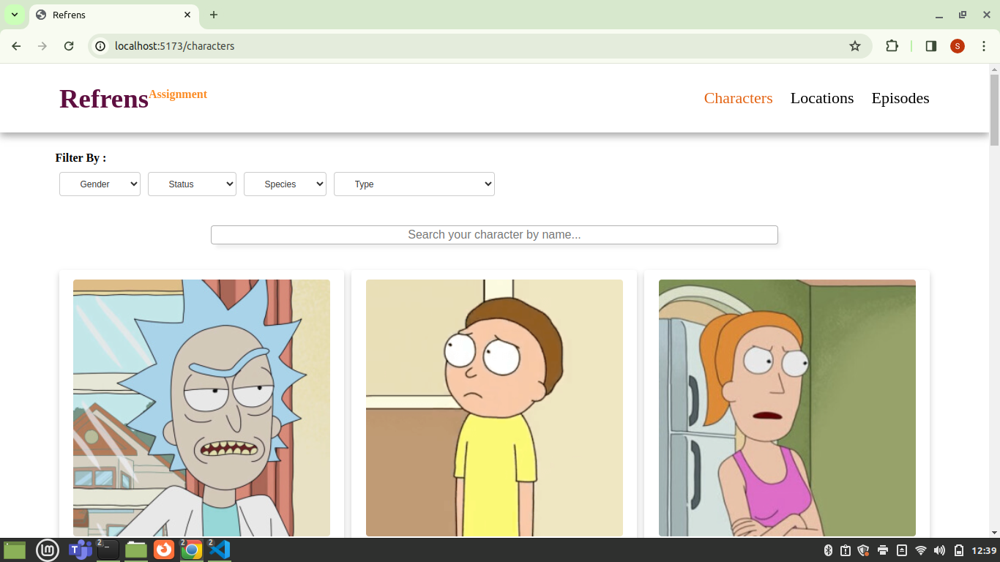
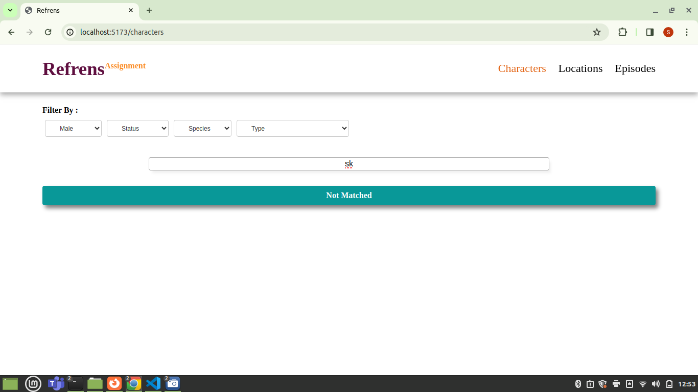
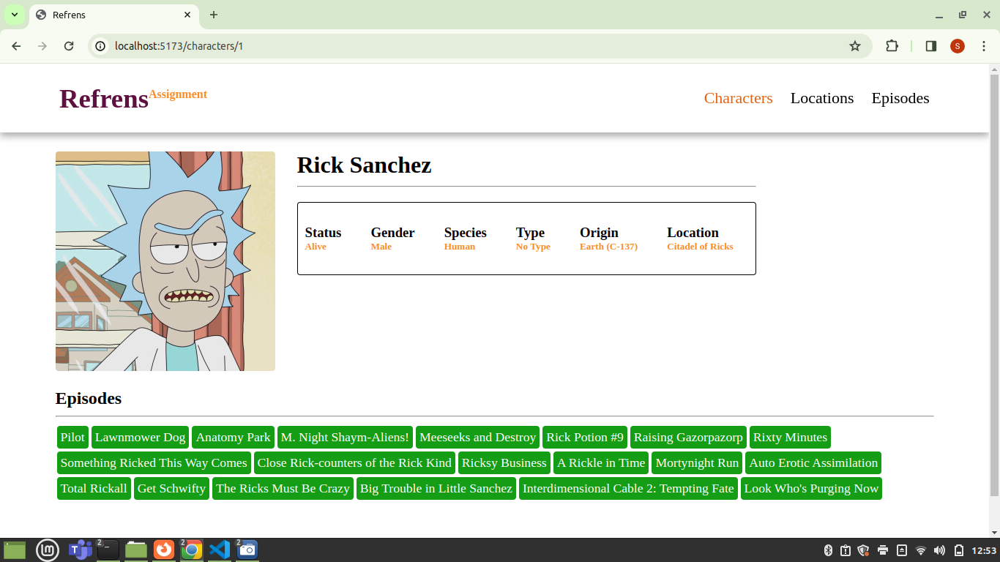
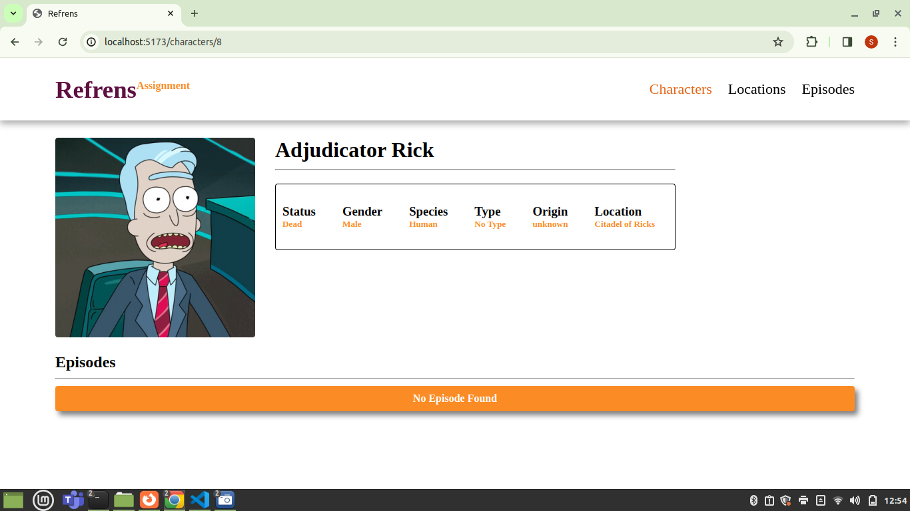

## Introduction

Assignment given by Refrens. It followes CRUD functionality ,searching and filtering features of multiple character cards by their details.

### Technologies
  - ReactJS + Vite for frontend
  - Context API for state management
  - Eslint to check potential error and syntax issues

## Assignment Name

Refrens Assignment

This is an assignment from Refrens. The basic objectives of this assignment are:
  - Character cards page with their details
  - Character profie page with additional details like their episodes
  - Ability to filter grid items on these fields (status, location, episode, gender, species, type)
  - Ability to navigate to an individual Character’s profile. Implement the following details in each profile

  Optional:
  - Page to display Locations in a grid of cards 
  - Page to display Episodes in a grid of cards

## Assignment Status

#### Example:

All the important component has been completed but optional are left due to time issue.
  Compeleted:
  - Characters cards component
  - Character profile component
  - Functionality to search character by name
  - Functionality to filter character details by their gender,status,type,species etc.
  - Feature to show all the episodes name of a perticular character

## Assignment Screen Shot(s)

 
 


## Requirements

For development, you will only need Node.js and a node global package, Yarn, installed in your environement.

### Node

- #### Node installation on Windows

  Just go on [official Node.js website](https://nodejs.org/) and download the installer.
  Also, be sure to have `git` available in your PATH, `npm` might need it (You can find git [here](https://git-scm.com/)).

- #### Node installation on Ubuntu

  You can install nodejs and npm easily with apt install, just run the following commands.

      $ sudo apt install nodejs
      $ sudo apt install npm

- #### Other Operating Systems
  You can find more information about the installation on the [official Node.js website](https://nodejs.org/) and the [official NPM website](https://npmjs.org/).

If the installation was successful, you should be able to run the following command.

    $ node --version
    v20.9.0

    $ npm --version
    10.1.0

## Description

## To start setting up the project

Step 1: Clone the repo

```bash
   $ git clone https://github.com/singhsharad529/Refrens-Assignment.git
```

Step 2: cd into the cloned repo and run:

```bash
   $ npm install
```

## Installation

```bash
    $ npm install

```

## Running the app

```bash
# development
    $ npm run dev

```

**Added a lint file there called: .eslintrc.json**
## Lint file testing
```bash
    $ npm run lint

```


## Author

- [**Sharad Kumar Singh**](https://singhsharad529.github.io/sharad-portfolio/)

```

```